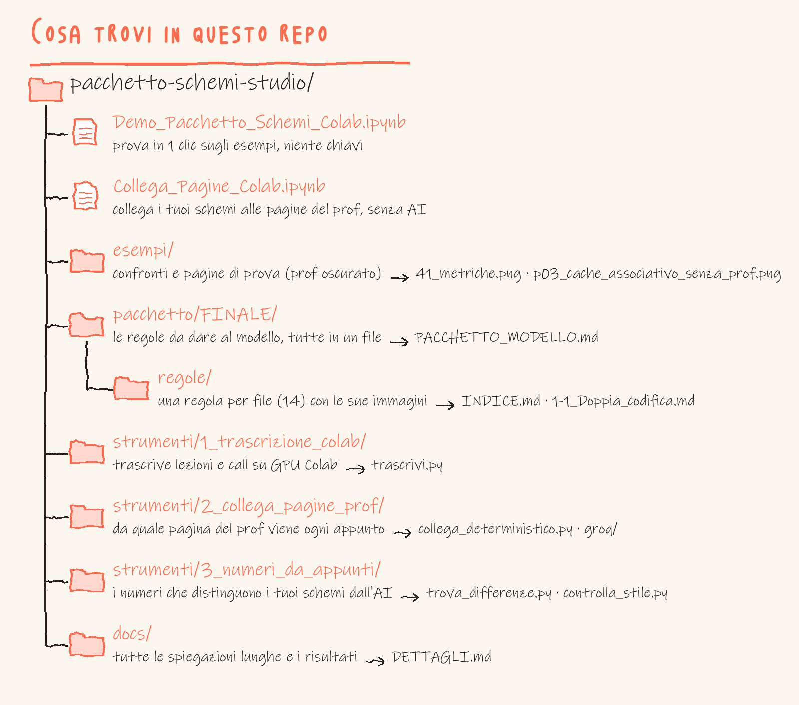
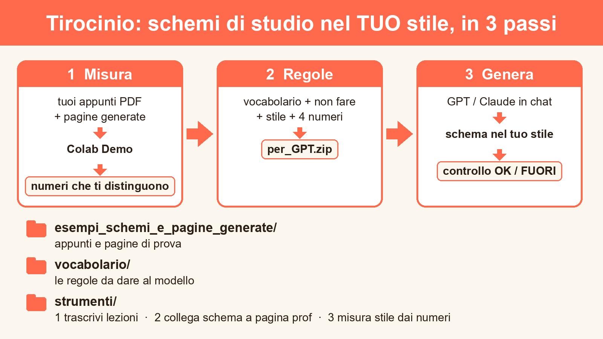

# Vocabolario di stile per generare schemi di studio (tirocinio UniVR)

Tirocinio di Informatica (UniVR): dai miei schemi di studio estraggo un **vocabolario di regole** (cosa fare, cosa non fare, stile, numeri misurabili) e lo do a un modello (Claude/GPT) perché generi schemi nuovi nel mio stile. Gli strumenti misurano quanto la pagina generata somiglia ai miei schemi e collegano ogni schema alla pagina del prof da cui nasce.

- **Prova in 1 clic:** bottone Colab qui sopra. Niente chiavi, gira sugli esempi inclusi.
- **Usa il vocabolario:** scarica `per_GPT.zip` dalla Demo e dallo a GPT o Claude in chat, poi la pagina del prof.
- **Scarica una versione vecchia:** tab *Commits* → *Browse files* → *Code* → *Download ZIP*.

## Video tutorial

| # | Video | Cosa mostra |
|---|---|---|
| 0 | [**Il repo in 2 minuti**](docs/video/0_il_repo_in_2_minuti.mp4) | **parti da qui:** giro vero del repo, cosa rappresenta ogni cartella e file |
| 1 | [Panoramica del repo](docs/video/1_panoramica_repo.mp4) | cosa c'è in ogni cartella e da dove partire |
| 2 | [Demo Colab → per_GPT.zip](docs/video/2_demo_colab_per_GPT.mp4) | un clic: numeri, controllo OK/FUORI, zip da dare al modello |
| 3 | [Collega schema e pagina del prof](docs/video/3_collega_schema_pagina_prof.mp4) | stesso numero e colore = stesso pezzo; con testo 15/15 |
| 4 | [Numeri e controllo OK/FUORI](docs/video/4_numeri_OK_FUORI.mp4) | i 4 numeri che cambiano il modello e `controlla_stile.py` |
| 5 | [Chat Claude gratuita](docs/video/5_chat_claude_gratuita.mp4) | 3 file + 1 riga, poi «correggi»: 2 difetti sistemati |
| 6 | [Usare il codice](docs/video/6_usare_il_codice.mp4) | i 3 comandi lanciati davvero, con il loro output: misura, controlla OK/FUORI, collega |
| 7 | [In chat, passo per passo](docs/video/7_in_chat_passo_passo.mp4) | quali file allegare e cosa scrivere: prompt, «correggi», «quale regola non era chiara?» |

| Cartella | Cosa c'è |
|---|---|
| `esempi_schemi_e_pagine_generate/` | appunti e pagine di prova |
| `vocabolario/` | le regole da dare al modello |
| `strumenti/` | 1 trascrivi lezioni · 2 collega schema a pagina prof · 3 misura stile dai numeri |

Spiegazioni complete e risultati: [docs/DETTAGLI.md](docs/DETTAGLI.md)
