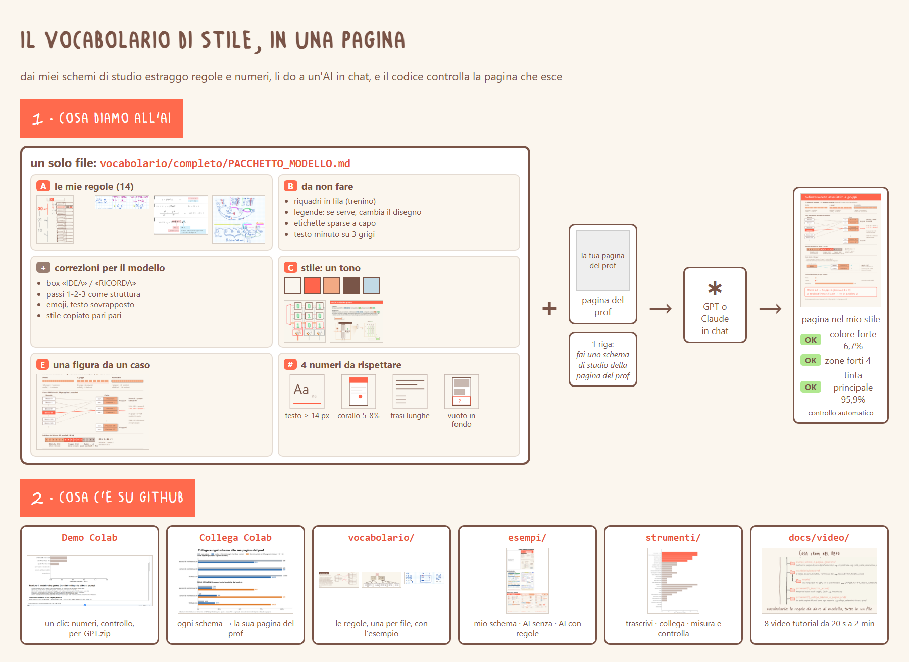

# Vocabolario di stile per generare schemi di studio (tirocinio UniVR)

Tirocinio di Informatica (UniVR): dai miei schemi di studio estraggo un **vocabolario di regole** (cosa fare, cosa non fare, stile, numeri misurabili) e lo do a un modello (Claude/GPT) perché generi schemi nuovi nel mio stile. Gli strumenti misurano quanto la pagina generata somiglia ai miei schemi e collegano ogni schema alla pagina del prof da cui nasce.

| Demo: numeri e controllo | Collega schemi e pagine del prof |
|---|---|
|  |  |

## Usare le regole in chat: una ricetta sola

Funziona con ChatGPT, Claude o Gemini, anche gratis. **Non serve Colab né un account Google.**

1. Scarica i 2 file della cartella [**per_la_chat/**](per_la_chat/): [PACCHETTO_MODELLO.md](per_la_chat/PACCHETTO_MODELLO.md) (le regole) e [FRASI_PER_IL_MODELLO.md](per_la_chat/FRASI_PER_IL_MODELLO.md) (i numeri).
2. Allegali in chat con la **pagina del prof**.
3. Incolla il testo di [PROMPT.txt](per_la_chat/PROMPT.txt).
4. Se c'è un errore: «non hai rispettato la regola X, correggi solo questo».

Il pacchetto completo resta anche in [vocabolario/completo/PACCHETTO_MODELLO.md](vocabolario/completo/PACCHETTO_MODELLO.md) (stesso file). Lo zip della Demo contiene gli stessi 3 file, con i tuoi numeri se li hai calcolati.

**Per chi è:** schemi con **disegni e colore** (come quelli di Architettura). Con appunti solo testo (Word) le regole sul disegno e la parte numeri servono poco.

## Il tuo vocabolario in 4 passi

1. **I tuoi schemi in PDF.** Meglio esportati da Canva/Word/GoodNotes (con testo vero). Una scansione o una foto va bene, ma si misura solo l'immagine; una foto deve avere il fondo bianco (ritagliala), se no l'ombra conta come disegno.
2. **Almeno 3 pagine generate dall'AI, senza regole.** In chat allega la pagina del prof e incolla [per_la_chat/PROMPT_SENZA_REGOLE.txt](per_la_chat/PROMPT_SENZA_REGOLE.txt) (il prompt «SENZA» dell'esperimento 40, quello delle pagine `claude_SENZA` di esempio); chat nuova per ogni pagina. Salva ogni risposta come `pagina.html` in una cartella sua (`generate/r1/`, `generate/r2/`, ...).
3. **I numeri che ti distinguono dall'AI:** Demo Colab, punto 4 (carichi PDF e pagine), oppure `trova_differenze.py` (vedi [strumenti/3](strumenti/3_misura_stile_dai_numeri/)). Esce il tuo `FRASI_PER_IL_MODELLO.md`: usalo al posto di quello in `per_la_chat/`.
4. **Le tue regole:** [vocabolario/D_MODULO_ESTRAI_REGOLE.md](vocabolario/D_MODULO_ESTRAI_REGOLE.md): una pagina del prof + il tuo schema, un modello estrae UNA regola, un secondo la prova su una pagina nuova. Il metodo intero: [docs/COME_ESTRARRE_LE_REGOLE.md](docs/COME_ESTRARRE_LE_REGOLE.md).

**Ogni file, uno per uno, con cos'è e quando ti serve:** [img/mappa_file.svg](img/mappa_file.svg)

**Scarica una versione vecchia:** tab *Commits* → *Browse files* → *Code* → *Download ZIP*.

## Video tutorial

Le GIF sono i primi 15 secondi, senza audio; il video intero è nel link (si scarica come .mp4).

| # | Anteprima | Video intero | Cosa mostra |
|---|---|---|---|
| 0 |  | [**Il repo in 2 minuti**](docs/video/0_il_repo_in_2_minuti.mp4) | **parti da qui:** giro vero del repo, cosa rappresenta ogni cartella e file |
| 1 |  | [Panoramica del repo](docs/video/1_panoramica_repo.mp4) | cosa c'è in ogni cartella e da dove partire |
| 2 |  | [Demo Colab → zip](docs/video/2_demo_colab_per_GPT.mp4) | un clic: numeri, controllo OK/FUORI, zip da dare al modello. *Nel video lo zip si chiama `per_GPT.zip`: ora `per_la_chat.zip`, con i 3 file della ricetta.* |
| 3 |  | [Collega schema e pagina del prof](docs/video/3_collega_schema_pagina_prof.mp4) | stesso numero e colore = stesso pezzo; con testo 15/15 |
| 4 |  | [Numeri e controllo OK/FUORI](docs/video/4_numeri_OK_FUORI.mp4) | i 4 numeri che cambiano il modello e `controlla_stile.py` |
| 5 |  | [Chat Claude gratuita](docs/video/5_chat_claude_gratuita.mp4) | 3 file + 1 riga, poi «correggi»: 2 difetti sistemati. *Il file dei numeri, nel video `NUMERI_DA_RISPETTARE`, ora è `FRASI_PER_IL_MODELLO.md` di [per_la_chat/](per_la_chat/).* |
| 6 |  | [Usare il codice](docs/video/6_usare_il_codice.mp4) | i 3 comandi lanciati davvero, con il loro output: misura, controlla OK/FUORI, collega |
| 7 |  | [In chat, passo per passo](docs/video/7_in_chat_passo_passo.mp4) | cosa scrivere: prompt, «correggi», «quale regola non era chiara?». *Il video dice «allega 4 file da per_GPT.zip»: ora bastano i 3 file di [per_la_chat/](per_la_chat/) (`numeri.json` non serve in chat).* |

## Cartelle

| Cartella | Cosa c'è |
|---|---|
| `per_la_chat/` | i 3 file da dare al modello in chat |
| `esempi_schemi_e_pagine_generate/` | appunti e pagine di prova |
| `vocabolario/` | le regole da dare al modello |
| `strumenti/` | 1 trascrivi lezioni · 2 collega schema a pagina prof · 3 misura stile dai numeri |

**Il controllo della Demo:** la pagina d'esempio (Claude + pacchetto, prova r1) passa i **3 numeri del colore** (colore forte, zone, tinta principale): è l'unica su 18 a farlo. Gli altri FUORI (testo piccolo, troppe pillole, fondo vuoto) sono il lavoro ancora da fare.

Spiegazioni complete e risultati: [docs/DETTAGLI.md](docs/DETTAGLI.md)
