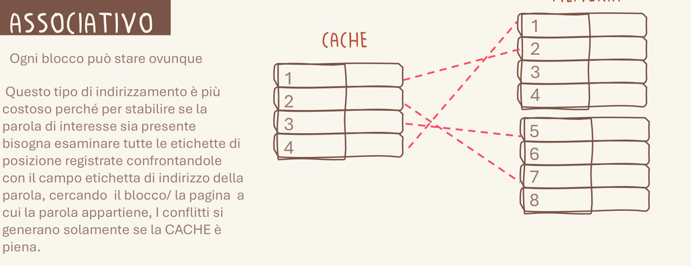

# 1.1 Doppia codifica (dual coding)

Quando una cosa va ricordata a memoria per forza, le metto accanto qualcosa che la rappresenta: parola e immagine collegate si ricordano meglio della sola parola.

## Quando scatta

«Quando una cosa va ricordata a memoria per forza»

## Ritaglio suo

Architettura_Gilberto.pdf, pag. 1 — Il testo da ricordare (cache associativa: ogni blocco puo' stare ovunque) ha accanto il disegno di cache e memoria con i collegamenti incrociati: parola e immagine dicono la stessa cosa. (giudizio esp. 34: buono)

## Esempio (solo esempio, non fa parte della regola)

- esempio: Architettura, cache associativa: accanto al testo da ricordare c'è il disegno di cache e memoria con i blocchi collegati.
