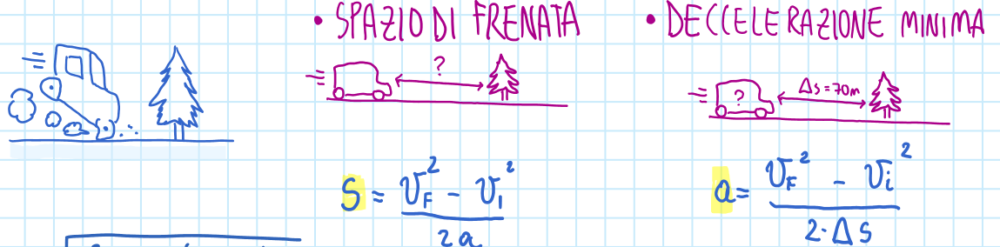

# 1.2 La parte intuitiva diventa disegno

Definizioni, informazioni, concetti intuitivi: la parte intuitiva del concetto diventa un disegno, la definizione resta accanto.

## Quando scatta

«Definizioni, informazioni, concetti intuitivi»

## Ritaglio suo

OneNote Fisica.pdf, pag. 27 — Spazio di frenata: l'auto che deve fermarsi prima dell'albero e' la parte intuitiva; sotto restano le formule. (giudizio esp. 34: buono)

## Esempio (solo esempio, non fa parte della regola)

- esempio: Fisica, spazio di frenata: l'auto contro l'albero è la parte intuitiva; sotto restano le formule.
