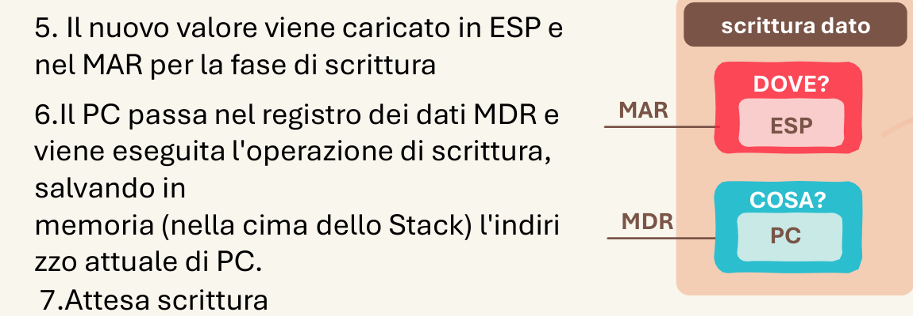

# 2.1 Togliere livelli di astrazione

Il problema o la materia di cui si sta studiando o parlando è molto pratica e pragmatica, ma spesso si è dovuto introdurre (o è presente) un livello di astrazione: consapevoli di ciò, si cerca di togliere questo velo.

*Una volta rimosso il velo, il contenuto può essere ricondotto a una rappresentazione generale del concetto.*

## Quando scatta

«è molto pratica e pragmatica, ma spesso si è dovuto introdurre (o è presente) un livello di astrazione»

## Ritaglio suo

Architettura_Gilberto.pdf, pag. 7 — Le microistruzioni astratte (Z_out, MAR_in, MDR_in, WRITE) tornano al problema pratico: scrivere un dato = DOVE? (ESP) e COSA? (PC). (giudizio esp. 34: buono)

## Esempio (solo esempio, non fa parte della regola)

- esempio: Fondamenti, pumping lemma: il lemma astratto diventa automi concreti da guardare; si vede subito quale linguaggio funziona.
