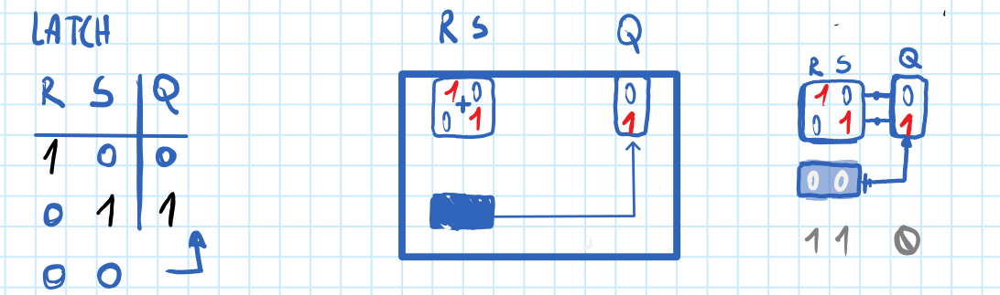

# 2.2 Isomorfismo spaziale (o mappatura isomorfica)

Quando la transcodifica arriva sul piano fisico: il concetto diventa oggetti, e la loro disposizione nello spazio ne ricalca la struttura.

## Quando scatta

«Quando la transcodifica arriva sul piano fisico»

## Ritaglio suo

OneNote Architettura degli elaboratori.pdf, pag. 14 — La tabella R S (giudizio esp. 34: Q del latch diventa una scatola con gli interruttori R, S e l'uscita Q: la disposizione degli oggetti ricalca la tabella. | buono)

## Esempio (solo esempio, non fa parte della regola)

- esempio: Architettura, latch: la tabella R S | Q diventa una scatola con gli interruttori R, S e l'uscita Q.
