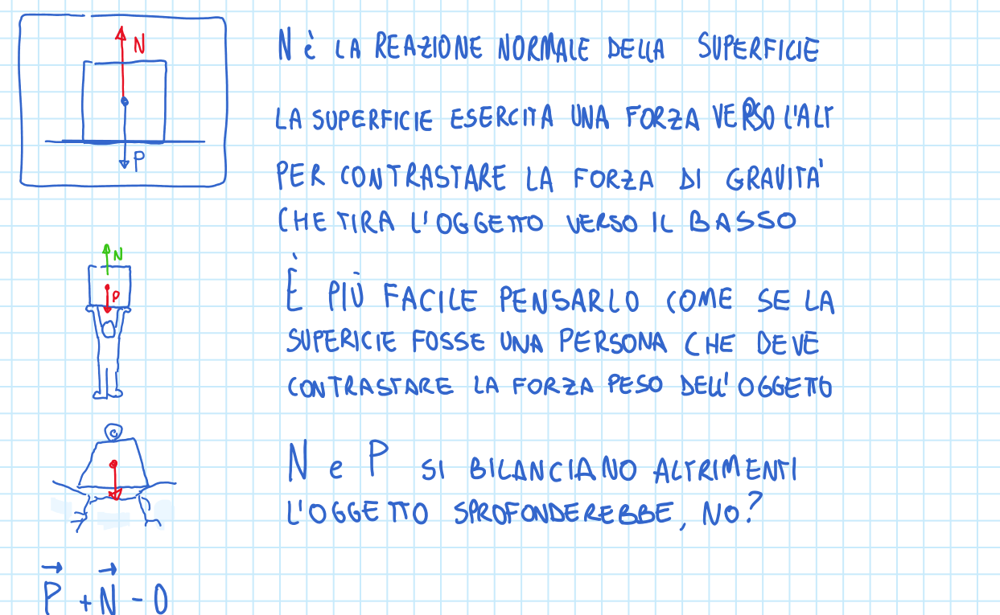

# 2.3 Impersonificazione nel problema pratico

Permette di «indossare» il problema e di impersonificarlo: attraverso questa empatia didattica porta a rivedersi nella soluzione del problema, oppure a riuscire a rappresentarlo meglio nel mondo reale.

*Questo avviene prima della lettura del testo del docente.*

*Percepito prima il problema, chi legge ne intuisce la natura e talvolta le soluzioni; quando queste vengono mostrate, le due esperienze si sommano e si rafforzano.*

## Quando scatta

«nel problema pratico» · «prima della lettura del testo del docente»

## Ritaglio suo

OneNote Fisica.pdf, pag. 20 — Reazione normale: 'e' piu' facile pensarlo come se la superficie fosse una persona che deve contrastare la forza peso'. Omino che regge il blocco. (giudizio esp. 34: buono)

## Esempio (solo esempio, non fa parte della regola)

- esempio: Fisica, lavoro: la forza è un uomo che tira uno pneumatico per uno spostamento s.
