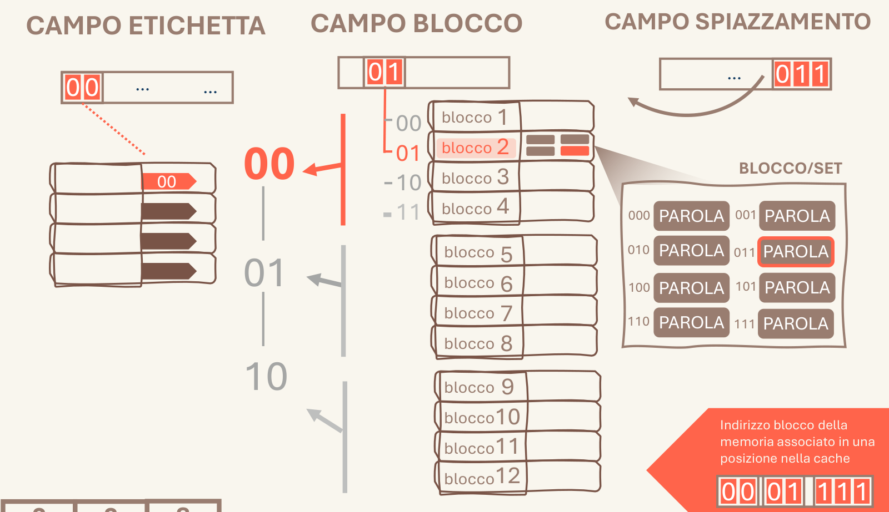

# 3.1 Innesco e risultato

Si individuano il punto di innesco (l'ingresso del processo) e il risultato finale (l'uscita): tutto ciò che sta in mezzo viene letto come un unico percorso continuo che li collega.

## Quando scatta

«visualizzazione di un intero processo, dall'innesco iniziale al risultato finale»

## Ritaglio suo

Architettura_Gilberto.pdf, pag. 2 — Cache diretta: dai tre campi (ingresso) al blocco, alla parola, fino al riquadro finale 'Indirizzo blocco ... 00|01|111' (uscita): un unico percorso. (giudizio esp. 34: buono)

## Numeri da controllare

(abbinamento numero-regola fatto da Claude; numeri da 41_ATTENZIONE_NUMERI)

- **vuoto nel terzo basso** (suo 25.1-54.2): Il disegno arriva fino in fondo: nel terzo basso della pagina resta vuoto al massimo circa metà dello spazio (lui 25-54%), non un terzo di foglio bianco.
- controllo: `controlla_stile.py pagina.png --sorgente pagina.html|svg`

## Esempio (solo esempio, non fa parte della regola)

- esempio: Architettura, cache: dal campo etichetta (zoom tratteggiato) alle righe della cache, ai 32 blocchi e alle 4 parole.
