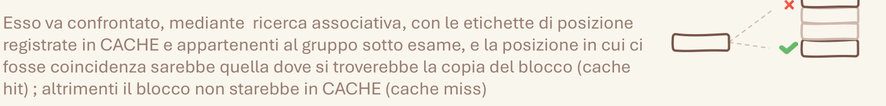

# 4.1 Effetto carte

Il lato grafico lo diminuisco e lo comprimo in maniera incompleta, perché si appoggia sul lato testuale per completare il significato: questo permette una forte minimalità negli schemi.

## Quando scatta

«si appoggia sul lato testuale per completare il significato»

## Ritaglio suo

Architettura_Gilberto.pdf, pag. 3 — Accanto al testo sulla ricerca associativa c'e' un disegno minimo (etichetta, tre righe, una x e una spunta): da solo non si capisce, col testo si'. (giudizio esp. 34: buono)

## Numeri da controllare

(abbinamento numero-regola fatto da Claude; numeri da 41_ATTENZIONE_NUMERI)

- **parole in frasi lunghe** (suo 31.6-86.3): Circa metà delle parole sta in frasi di almeno 5 parole, su righe larghe almeno un terzo della pagina.
- controllo: `controlla_stile.py pagina.png --sorgente pagina.html|svg`

## Esempio (solo esempio, non fa parte della regola)

Nessun esempio scritto nel vocabolario.
