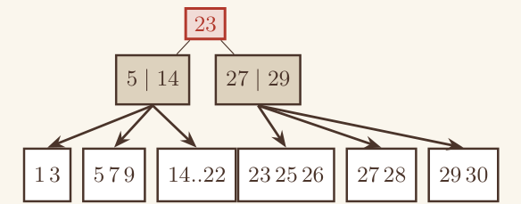

# 4.2 Grafica efficiente

Il disegno deve essere autonomo rispetto al testo, altrimenti si ricade spesso nell'errore di pigrizia grafica: il testo diventa una ridondanza per aumentare la chiarezza su più piani, oppure si rientra in casi già citati, come quello dell'effetto carte (4.1).

## Quando scatta

«Il disegno deve essere autonomo rispetto al testo»

## Ritaglio suo

BasiDati 19_Svolto_BTree_fanout5.pdf, pag. 1 — L'albero finale (radice 23, due interni, foglie) si legge da solo senza il testo accanto. (giudizio esp. 34: medio)

## Esempio (solo esempio, non fa parte della regola)

Nessun esempio scritto nel vocabolario.
