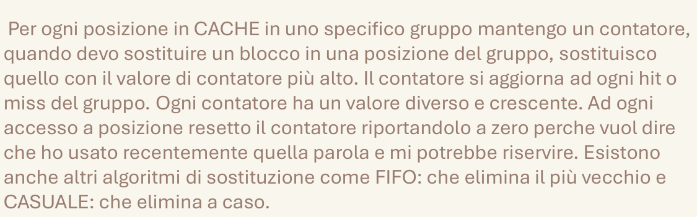

# 5.1 Tono neutro

Colori neutri e calmi: non richiama costantemente l'attenzione dell'occhio. Ottimo per qualcosa che deve essere letto, e poi basta.

## Quando scatta

«Ottimo per qualcosa che deve essere letto, e poi basta.»

## Ritaglio suo

Architettura_Gilberto.pdf, pag. 4 — Testo senza colori ne' contrasti: si legge e basta. (giudizio esp. 34: buono)

## Numeri da controllare

(abbinamento numero-regola fatto da Claude; numeri da 41_ATTENZIONE_NUMERI)

- **testo a corpo >= 14 px** (suo 74.2-100.0): Il testo corrente ha font-size 16-19 px su una pagina larga 794 px (12-14 pt su A4); sotto i 14 px solo note rare (lui: almeno il 74% dei caratteri a 14 px o più).
- controllo: `controlla_stile.py pagina.png --sorgente pagina.html|svg`

## Esempio (solo esempio, non fa parte della regola)

- esempio: Il testo di Architettura, calmo, e accanto la sua grafica originale senza scritte: lo sguardo resta tranquillo.
