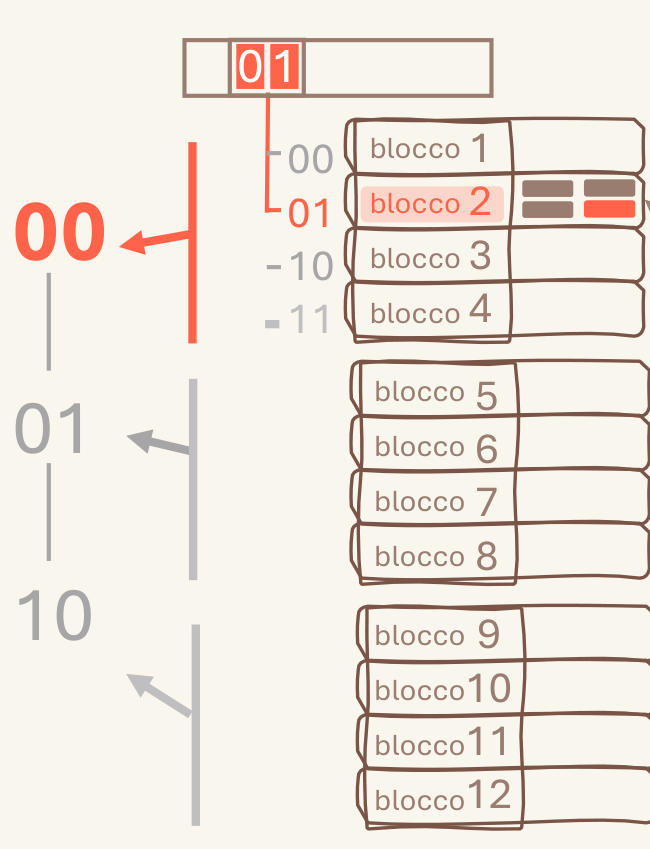

# 5.2 Richiamo dell'attenzione

Il richiamo si gioca sul colore e sul contrasto: alcuni elementi accesi accanto ad altri spenti, oppure tutto colorato ma con una palette calma. Un attimo di contrasto, soprattutto accanto a elementi neutri, crea un flusso di attenzione che parte e arriva su questi elementi: utile quando l'elemento è importante.

*Il testo tenue, al contrario, viene letto come contorno.*

## Quando scatta

«utile quando l'elemento è importante»

## Ritaglio suo

Architettura_Gilberto.pdf, pag. 2 — Tutto grigio-marrone, solo 00 / 01 / blocco 2 in rosso: l'occhio va dritto al caso che si segue. (giudizio esp. 34: buono)

## Numeri da controllare

(abbinamento numero-regola fatto da Claude; numeri da 41_ATTENZIONE_NUMERI)

- **colore forte, % pagina** (suo 3.7-14.3): Un solo colore forte, il corallo #FF654C, pieno, su circa il 5-8% della pagina (mai oltre il 14%): una fascia titolo larga quanto la pagina e alta 50-70 px su 1123, più 1-2 evidenziazioni piccole.
- controllo: `controlla_stile.py pagina.png --sorgente pagina.html|svg`

## Esempio (solo esempio, non fa parte della regola)

- esempio: Testo neutro con qualche colore tenue; al centro un solo elemento in contrasto, e le frecce dal testo puntano a lui.
- esempio: Con il colore: tutti neutri, uno solo acceso, tanti colori più quelli nati senza volerlo (sfumature, sovrapposizioni, tinte quasi uguali).
