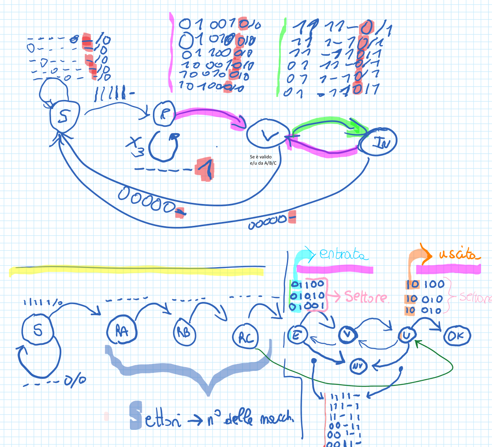

# 5.3 Richiamo continuo

Molti colori e contrasti: richiama molta attenzione e, se i colori sono presenti anche fuori dal punto, diventa un richiamo continuo dove l'attenzione continua a ricadere. Se servono più colori senza troppa attenzione si usa una palette pastello (vale anche per i contrasti).

## Quando scatta

«Molti colori e contrasti» · «Se servono più colori senza troppa attenzione»

## Ritaglio suo

OneNote Blocco appunti di Gilberto.pdf (sezione Elaborato), pag. 74 — Esempio del fenomeno (in negativo): rosa, verde, celeste, arancio, giallo, rosso e evidenziatori ovunque; l'attenzione ricade continuamente e nessun punto emerge. (giudizio esp. 34: medio)

## Numeri da controllare

(abbinamento numero-regola fatto da Claude; numeri da 41_ATTENZIONE_NUMERI)

- **colore forte, % pagina** (suo 3.7-14.3): Un solo colore forte, il corallo #FF654C, pieno, su circa il 5-8% della pagina (mai oltre il 14%): una fascia titolo larga quanto la pagina e alta 50-70 px su 1123, più 1-2 evidenziazioni piccole.
- controllo: `controlla_stile.py pagina.png --sorgente pagina.html|svg`

## Esempio (solo esempio, non fa parte della regola)

- esempio: Architettura, macchina a stati: tutto scritto a mano in stampatello, quindi tutto richiama l'attenzione e non risalta niente (troppo).
- esempio: Spesso non ce ne si rende conto: tre pagine generate negli esperimenti (GPT-5.5, Gemini, Claude Sonnet). Ogni riquadro ha un proprio colore di bordo, intestazione e sfondo, a cui si sommano evidenziazioni e avvisi: decine di tinte sature competono senza gerarchia e nessun elemento emerge come punto d'arrivo.
