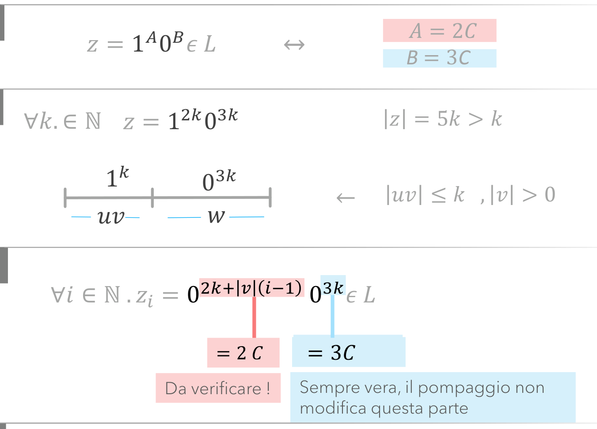

# 5.4 Collego elementi senza fili

Uno dei modi ipertestuali più semplici per collegare due elementi è il colore: la parola nel testo e il pezzo nel disegno hanno lo stesso colore. Vale anche quando gli elementi hanno la stessa forma: è il colore dietro a dire quale ruolo hanno.

Il significato di un colore può restare locale: serve a seguire un elemento attraverso i passaggi di una stessa dimostrazione, senza valere per l'intero documento.

## Quando scatta

«per collegare due elementi» · «serve a seguire un elemento attraverso i passaggi di una stessa dimostrazione»

## Ritaglio suo

Pumping Lemma - Schemi Pratici, pag. 6 — A = 2C in rosa e B = 3C in azzurro: lo stesso rosa e azzurro tornano sotto gli esponenti e nelle equazioni finali. (giudizio esp. 34: buono)

## Esempio (solo esempio, non fa parte della regola)

- esempio: Architettura, microistruzioni: riquadri tutti uguali; il colore dietro dice il ruolo: rosso = DOVE? (indirizzo, MAR), azzurro = COSA? (dato, MDR).
